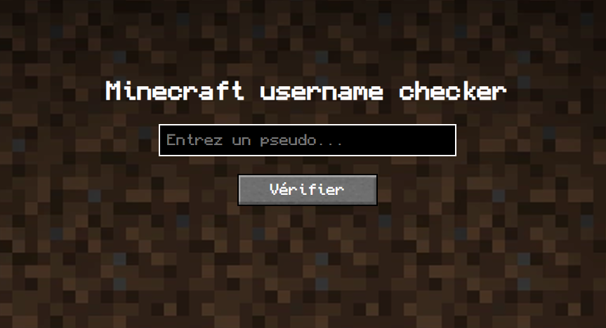

# minecraft-username-checker
Un vérificateur de pseudo Minecraft en PHP<br><br>

Vérifie si un pseudo est disponible à l'utilisation ou pas<br>
# Comment ça marche ?
On récupère un bloc json contenant les informations de l'utilisateur avec l'api Minetools
```php
<?php
    #On récupère le contenu de l'api Minetools
    $json = file_get_contents("https://api.minetools.eu/uuid/$username");
    #On décode le json de l'api
    $obj = json_decode($json);
    #On défini le status du compte dans une variable
    $status = $obj->status;
?>
```
On vérifie si l'information de status est égale à "ERR" (n'a pas d'uuid) ou OK (a un uuid)
```php
<?php
    if($status == "ERR") {
        #On indique dans une variable de session que le pseudo est disponible
        $_SESSION['message'] = "Ce pseudo est disponible :)";
    }
    #Si le compte a un uuid
    else if($status == "OK") {
        #On indique dans une variable de session que le pseudo n'est pas disponible
        $_SESSION['message'] = "Ce pseudo n'est pas disponible :(";
    }
?>
```
# Crédits
Un grand merci à <a href="api.minetools.eu">L'api Minetools</a> qui m'a aidé à réaliser ce petit projet
